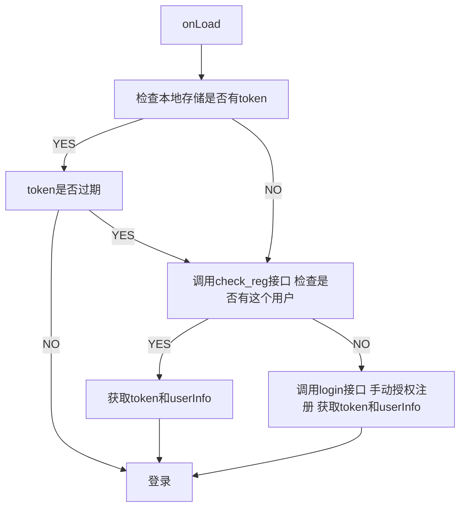

# 小程序登录

## 名词

| 名称        | 作用                               |
| ----------- | ---------------------------------- |
| openId      | 1.用户的唯一标识 2.微信支付        |
| session_key | 用于获取unionId                    |
| Token       | 服务器生成的标识用于后续服务的鉴权 |

## 小程序登录流程

## openId 的使用

- openId 不能直接存储到小程序客户端的原因 
  1. 处于安全考虑 openId 不能直接存储在小程序的客户端
  2. openId 是固定不点的，也就是如果作为登录的一个凭证不会失效

## Token

由后端发送给小程序客户端，作为用户是否登录的凭证（有失效期）

这个 Token 最好存储在后端的缓存中（Redis）

