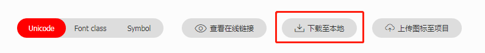
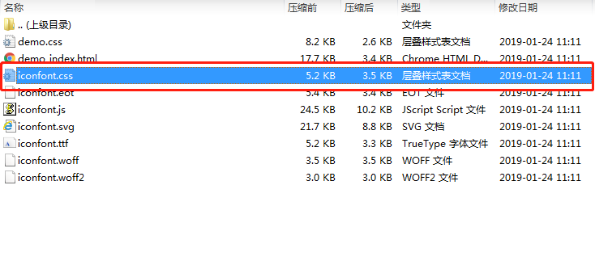
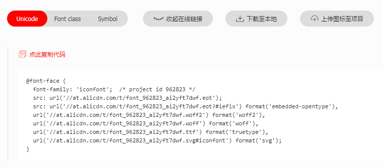

# 小程序开发的坑
## 切换至后台后网络请求就GG了
在程序切换至后台之后（比如退回至微信后），小程序的网络请求就会被拦截掉（但是代码还是在运行）。

不过，小程序在前台，并且处于息屏状态的时候，网络请求还是可以继续发送的。

> [HTTPS 网络请求网络说明](https://developers.weixin.qq.com/miniprogram/dev/framework/ability/network.html)

## 接收发送 arraybuffer 类型的数据

- 发送 `arraybuffer`

  1. 首先准备好装载数据的数组

     `let arr = [1,2,3,4,5]`

  2. 使用 `Typed Array` 包装一下数组

     `let unit8arr = new Uint8Array(arr)`

  3. 发送 `AJAX`请求

     ```javascript
     http.request({
         method: 'POST',
         url: 'senddata/',
         header: {
         	'content-type': 'application/octet-stream'
         },
         data: uint8Arr.buffer
         })
         	.then(console.log)
         	.catch(console.log)
     ```

- 接收 `arraybuffer`

  设置 `AJAX`请求的 `responseType` 为 `arraybuffer` 并解码

  ```javascript
  http.request({ 
      url: 'getdata/',
      responseType: 'arraybuffer'
  })
      .then(res => {
          let buffer = res.data
          let uint8Arr = new Uint8Array(buffer)	// 将接收到的arraybuffer通过Unit8Array包装一次
          let dataList = Array.from(uint8Arr)		// 使用Array.from把uint8Arr转换位数组就OK
      })
      .catch(console.log)
  ```

## 小程序不能使用 CSS预处理器

解决方案：

1. 在 `VS Code` 中安装 `Easy WELESS`
2. 在对应的页面中创建一个 `index.less` 
3. 编译好的样式会自动覆盖 `index.wxss`

## 向子组件传递对象类型的数据的时候，小程序会改变这个对象

场景：

在父组件中向子组件中传递一个使用 `dayjs`生成的对象后，子组件并不能调用生成的对象所包含的方法。

所以最后把基本类型字符串 `YYYY/MM/HH`传递给子组件，在子组件中通过 `dayjs`来得到生成的对象。

> [轻量级js日期和时间操作库day.js](http://www.ptbird.cn/day-js.html)
>
> [dayjs API](https://github.com/iamkun/dayjs/blob/dev/docs/zh-cn/API-reference.md)

## 小程序使用iconfont

1. 选择好需要的字体图表后下载至本地
    

1. 解压下载好的压缩文件，把 `iconfont.css`改名为 `iconfont.wxss` 放到小程序项目的`style`目录下

    

2. 在 `app.wxss`中引入 `iconfont.wxss`

   `@import './style/iconfont.wxss';`

3. 复制`iconfont`项目中 `Unicode`的在线链接，并覆盖小程序项目中`iconfont.wxss`中的 `@font-face`

    
    
    

4. 使用`iconfont`的时候只要按照如下方式即可

   ```html
   <text class="iconfont icon-heart" style="margin:6rpx;"></text>
   ```


