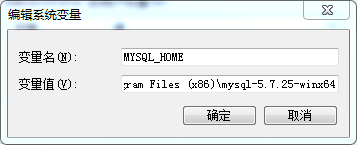
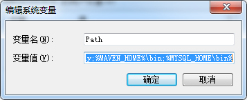

# 在 Window 下使用 MySQL

## 安装MySQL
- 下载安装包：[MySQL Community Server 5.7 »](https://dev.mysql.com/downloads/mysql/5.7.html#downloads)
- 解压安装包到任意目录

## 配置MySQL

- 添加环境变量

    
    
    

- 配置`my.ini`

    ```ini
    [mysql]
    # 设置mysql客户端默认字符集
    default-character-set=utf8
    [mysqld]
    # 设置3306端口
    port = 3306
    # 设置mysql的安装目录
    basedir=E:\\Program Files (x86)\\mysql-5.7.25-winx64
    # 设置 mysql数据库的数据的存放目录，MySQL 8+ 不需要以下配置，系统自己生成即可，否则有可能报错
    datadir=E:\\Program Files (x86)\\mysql-5.7.25-winx64\\data
    # 允许最大连接数
    max_connections=20
    # 服务端使用的字符集默认为8比特编码的latin1字符集
    character-set-server=utf8
    # 创建新表时将使用的默认存储引擎
    default-storage-engine=INNODB
    ```

- 接下来我们来启动下 MySQL 数据库：

    以管理员身份打开 cmd 命令行工具，切换目录：

    ```
    cd E:\Program Files (x86)\mysql-5.7.25-winx64\bin
    ```

    初始化数据库：

    ```
    mysqld --initialize --console
    ```

    执行完成后，会输出 root 用户的初始默认密码，如：

    ```
    ...
    2019-01-31T08:14:11.839422Z 1 [Note] A temporary password is generated for 
    root@localhost: Tic7;pL?jC10
    ...
    ```

    `Tic7;pL?jC10` 就是初始密码，后续登录需要用到，你也可以在登陆后修改密码。

    输入以下安装命令：

    ```
    mysqld install
    ```

    启动输入以下命令即可：

    ```
    net start mysql
    ```

## 常用指令

| 描述     | 命令             |
| -------- | ---------------- |
| 启动服务 | net start MySQL  |
| 停止服务 | net stop MySQL   |
| 卸载服务 | sc delete MySQL  |
| 登录服务 | mysql -u root -p |

## 使用 Navicat 管理 MySQL

### 创建连接

- 在 Navicat 中使用 root 账户的默认密码登录 mysql 会出现 Your password has expired（你的密码过期）的问题
  解决方案：

  ```
  1. 使用root用户命令行登录（命令行登录不存在过期）。
  2. 登陆后直接输入 > set password = password('123456');
  ```

