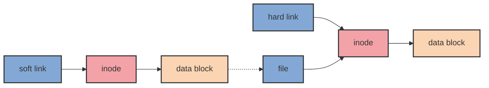

# Learning-The-Shell

## What Is the shell 什么是脚本

| **命令** | **EN**                                   | **ZH**             |
| -------- | ---------------------------------------- | ------------------ |
| `date`   | Displays the current time and date.      | 显示当前日期       |
| `cal`    | Displays a calendar of thecurrent month. | 显示日历           |
| `df`     | Disk free                                | 剩余磁盘           |
| `free`   | Display the amount of free memor         | 剩余内存           |
| `exit`   | Ending a Terminal Session.               | 关闭一个命令行会话 |

## Navigation 导航

| **命令** | **EN**                                   | **ZH**         |
| -------- | ---------------------------------------- | -------------- |
| `pwd`    | Print name of current working directory. | 显示当前文件夹 |
| `cd`     | Change directory.                        | 切换文件夹     |
| `ls`     | List directory contents.                 | 显示文件夹内容 |

## Exploring the System 探索系统

| **命令** | **EN**                    | **ZH**         |
| -------- | ------------------------- | -------------- |
| `ls`     | List directory contents.  | 显示文件夹内容 |
| `file`   | Determining a File’s Type | 查看文件类型   |
| `less`   | Viewing File Contents     | 查看文件内容   |

## Manipulating Files and Directories 操作文件和目录

| **命令** | **EN**                            | **ZH**                  |
| -------- | --------------------------------- | ----------------------- |
| `cp`     | Copy files and directories        | 拷贝文件和文件夹        |
| `mv`     | Move/rename files and directories | 移动/重命名文件和文件夹 |
| `mkdir`  | Create directories                | 创建文件夹              |
| `rm`     | Remove files and directories      | 删除文件和文件夹        |
| `ln`     | Create hard and symbolic links    | 创建硬链接和符号链接    |

### cp - Copy Files and Directories

| **命令**              | **结果**                                                                                                                                                          |
| --------------------- | ----------------------------------------------------------------------------------------------------------------------------------------------------------------- |
| `cp file1 file2`      | 把 file1 拷贝到 file2 . 如果 file2 存在， 那么 file2 的内容被 file1 的内容覆盖 . 如果 file2 不存在，那么 创建 file2 ，并把 file1 的内容拷贝到 file2。             |
| `cp -i file1 file2`   | 与上一条命令相似，不同的是如果 file2 存在，那么 file2 被覆盖前会提示用户。                                                                                        |
| `cp file1 file2 dir1` | 把 file1 和 file2 拷贝进 dir1，前提是 dir1 一定要存在。                                                                                                           |
| `cp dir1/* dir2`      | 使用通配符，把 dir1 的内容都拷贝进 dir 中，前提是 dir2 一定要存在。                                                                                               |
| `cp -r dir1 dir2`     | 把 dir1 的内容拷贝进 dir2 ，如果 dir2 不存在，就新建 dir2，并把 dir1 的内容拷贝进 dir2 .如果 dir2 存在就把 dir1 这个文件夹整个拷贝进 dir2，成为 dir2 的子文件夹。 |

> `-i` 代表 `interactive`交互的（会有提示问你要不要这样做）
>
> `-r` 代表 `recursive`递归的（递归地复制目录及其内容）

### mv - Move and Rename Files

| **命令**              | **结果**                                                                                                                                                                |
| --------------------- | ----------------------------------------------------------------------------------------------------------------------------------------------------------------------- |
| `mv file1 file2`      | 把 file1 移动到 file2 .。如果 file2 存在， 那么 file2 的内容被 file1 的内容覆盖 .。如果 file2 不存在，那么 创建 file2 ，并把 file1 的内容拷贝到 file2，file1 不再存在。 |
| `mv -i file1 file2`   | 与上一条命令相似，不同的是如果 file2 存在，那么 file2 被覆盖前会提示用户。                                                                                              |
| `mv file1 file2 dir1` | 把 file1 和 file2 移动到 dir1，前提是 dir1 一定要存在。                                                                                                                 |
| `mv dir1 dir2`        | 如果 dir2 不存在, 创建 dir2 并把 dir1 的内容移动到 dir2 并删除 dir1.。如果 dir2 存在，把 dir1 移动到 dir2，成为 dir2 的子文件夹。                                       |

### rm - Remove Files and Directories

| **命令**            | **结果**                                                       |
| ------------------- | -------------------------------------------------------------- |
| `rm file1`          | 静默删除 file1。                                               |
| `rm -i file1`       | 与上一条命令类似，区别是在执行删除之前会提示用户确认。         |
| `rm -r file1 dir1`  | 删除 file1 和 dir1 以及 dir1 中的内容                          |
| `rm -rf file1 dir1` | 与上一条命令类似，但如果 file1 或 dir1 不存在，rm 将静默继续。 |

> **注意**
>
> 类 Unix 的操作系统比如 Linux 是没有撤销删除命令的。
>
> 一旦你使用 `rm` 命令删除一些文件，它就不存在了。Linux 假定你很聪明并且知道你在做什么。
>
> 要特别小心使用通配符。 请考虑下面这个经典的例子。 比方说，你想在一个目录仅删除`HTML`文件。 为此，请键入以下内容：
>
> ```shell
> rm *.html
> ```
>
> 这是正确的，但如果你不小心在 `*` 和 `.html` 之间放置了一个空格
>
> ```shell
> rm * .html
> ```
>
> `rm` 命令将删除目录中的所有文件，然后抱怨没有名为`.html`的文件。
>
> 这里有一个实用的提示：每当你使用带有通配符的`rm`命令之前（除了仔细检查你的输入！），先用`ls`测试通配符。 这会让你看到即将被删除的文件。 然后按向上箭头调用该命令并用`rm`替换`ls`。

### ln - Create Links

#### Hard Links

```shell
ln file link
```

#### Symbolic Links

```shell
ln -s item link
```

#### 区别



由于硬链接是有着相同 inode 号仅文件名不同的文件，因此硬链接存在以下几点特性：

-   文件有相同的 inode 及 data block；
-   只能对已存在的文件进行创建；
-   不能交叉文件系统进行硬链接的创建；
-   不能对目录进行创建，只可对文件创建；
-   删除一个硬链接文件并不影响其他有相同 inode 号的文件。

软链接与硬链接不同，若文件用户数据块中存放的内容是另一文件的路径名的指向，则该文件就是软连接。软链接就是一个普通文件，只是数据块内容有点特殊。软链接有着自己的 inode 号以及用户数据块。因此软链接的创建与使用没有类似硬链接的诸多限制：

-   软链接有自己的文件属性及权限等；
-   可对不存在的文件或目录创建软链接；
-   软链接可交叉文件系统；
-   软链接可对文件或目录创建；
-   创建软链接时，链接计数 i_nlink 不会增加；
-   删除软链接并不影响被指向的文件，但若被指向的原文件被删除，则相关软连接被称为死链接（即 dangling link，若被指向路径文件被重新创建，死链接可恢复为正常的软链接）。

> [理解 Linux 的硬链接与软链接](https://www.ibm.com/developerworks/cn/linux/l-cn-hardandsymb-links/index.html)

## Working With Commands 使用命令

| **命令**  | **EN**                                            | **ZH**                       |
| --------- | ------------------------------------------------- | ---------------------------- |
| `type`    | Indicate how a command name is interpreted        | 显示指定命令的类型           |
| `which`   | Display which executable program will be executed | 查找并显示给定命令的绝对路径 |
| `help`    | Get help for shell builtins                       | 显示内置 shell 的帮助信息    |
| `man`     | Display a command’s manual page                   | 查看 Linux 中的指令帮助      |
| `apropos` | Display a list of appropriate commands            | 在 whatis 数据库中查找字符串 |
| `info`    | Display a command’s info entry                    | Linux 下 info 格式的帮助指令 |
| `whatis`  | Display one-line manual page descriptions         | 查询一个命令执行什么功能     |
| `alias`   | Create an alias for a command                     | 用来设置指令的别名           |

### 什么是命令

命令可以是以下四种类型之一

| **概念**   | **描述**                                                            |
| ---------- | ------------------------------------------------------------------- |
| 可执行程序 | 就像我们在 `/usr/bin`这个文件夹中看到的文件一样。比如常用的 `yum`。 |
| 内置 shell | Bash 支持一些叫作内置 shell 的命令。举个例子 `cd`就是一个内置命令。 |
| shell 函数 | 脚本。                                                              |
| 别名       | 通过组合其他命令构成的一个自定义命令。                              |

### 认识命令

#### type - 显示一个命令的类型

```shell
[root@golinux /]# type yum
yum is /usr/bin/yum
[root@golinux /]# type type
type is a shell builtin
[root@golinux /]# type ll
ll is aliased to `ls -l --color=auto'
```

#### which - 显示可执行文件的位置

有时，系统上安装了多个版本的可执行程序。 虽然这在桌面系统上并不常见，但在较大的服务器上并不罕见。 要确定给定可执行文件的确切位置，请使用which命令。

```shell
[root@golinux /]# which yum
/usr/bin/yum
[root@golinux /]# which type
/usr/bin/which: no type in (/usr/local/sbin:/usr/local/bin:/usr/sbin:/usr/bin:/root/bin)
[root@izbp13gye2rcpn1at3vj69z /]# which ll
alias ll='ls -l --color=auto'
	/usr/bin/ls
```

### 获取命令文档

#### help - 显示内置 shell 的帮助信息

```shell
[root@golinux /]# help cd
cd: cd [-L|[-P [-e]]] [dir]
    Change the shell working directory.
    
    Change the current directory to DIR.  The default DIR is the value of the
    HOME shell variable.
    
    The variable CDPATH defines the search path for the directory containing
    DIR.  Alternative directory names in CDPATH are separated by a colon (:).
    A null directory name is the same as the current directory.  If DIR begins
    with a slash (/), then CDPATH is not used.
    
    If the directory is not found, and the shell option `cdable_vars' is set,
    the word is assumed to be  a variable name.  If that variable has a value,
    its value is used for DIR.
    
    Options:
        -L	force symbolic links to be followed
        -P	use the physical directory structure without following symbolic
    	links
        -e	if the -P option is supplied, and the current working directory
    	cannot be determined successfully, exit with a non-zero status
    
    The default is to follow symbolic links, as if `-L' were specified.
    
    Exit Status:
    Returns 0 if the directory is changed, and if $PWD is set successfully when
    -P is used; non-zero otherwise.
```

#### --help  - 显示可执行程序的帮助信息

```shell
[root@golinux /]# mkdir --help
Usage: mkdir [OPTION]... DIRECTORY...
Create the DIRECTORY(ies), if they do not already exist.

Mandatory arguments to long options are mandatory for short options too.
  -m, --mode=MODE   set file mode (as in chmod), not a=rwx - umask
  -p, --parents     no error if existing, make parent directories as needed
  -v, --verbose     print a message for each created directory
  -Z                   set SELinux security context of each created directory
                         to the default type
      --context[=CTX]  like -Z, or if CTX is specified then set the SELinux
                         or SMACK security context to CTX
      --help     display this help and exit
      --version  output version information and exit

GNU coreutils online help: <http://www.gnu.org/software/coreutils/>
For complete documentation, run: info coreutils 'mkdir invocation'

```

#### man - 在线参考手册界面

#### apropos - 搜索手册页名称和描述

#### whatis - 显示手册页描述

### 使用 `alias` 创建自己的命令

## todo Redirection 重定向

## todo Seeing the World as the Shell Sees it 用脚本的方式解决问题

## todo Advanced Keyboard Tricks 高级键盘技巧

## todo Permissions 权限

## todo Processes 进程

## todo The Environment 环境

## todo A Gentle Introduction to VIM 一个柔和的 VIM 介绍

## todo Customizing the Prompt 自定义提示

| | | |
| | | |
| | | |
| | | |
