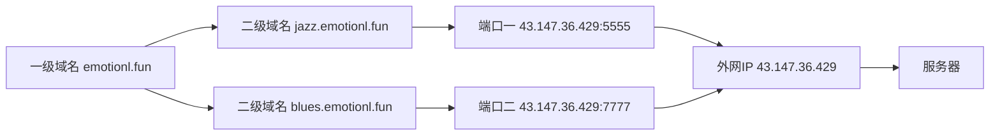

# Nginx反向代理

## 真实应用

### 背景

一台阿里云ECS，一个域名

### 需求

`emotionl.fun` 的二级域名分别指向服务器的两个服务




### 实现思路

使用`nginx`的`upstream`控制上游服务器，`用proxy_pass进行反向代理`

### 操作

1. 使用第一台 `nginx` 开启两个静态服务

   ```nginx
   worker_processes 1;
   
   events {
       worker_connections 1024;
   }
   
   http {
       include mime.types;
       default_type application/octet-stream;
       sendfile on;
       keepalive_timeout 65;
       gzip on;
       gzip_min_length 1024;
       gzip_comp_level 2;
       gzip_types text/plain text/css application/x-javascript application/javascript application/xml;
       server {
           listen 3000;
           location / {
               alias test_website/jazz/;
           }
           location = /50x.html {
               root html;
           }
           error_page 500 502 503 504  /50x.html;
       }
       server {
           listen 7777;
           location / {
               alias test_website/blues/;
           }
           location = /50x.html {
               root html;
           }
           error_page 500 502 503 504  /50x.html;
       }
   }
   ```

2. 使用第二台 `nginx`开启反向代理 TODO
