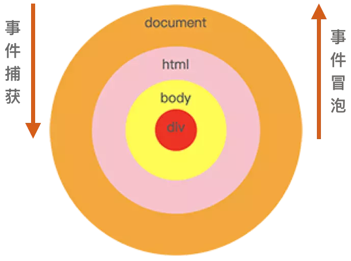

# JavaScript设计模式

## 单例模式

### 定义

保证一个类仅有一个实例，并提供一个访问它的全局访问点。

### 实现方法

判断系统是否已经有这个单例，如果有则返回，如果没有则创建，确保了一个类只有一个实例对象。

### 适用场景

当您想控制实例数目，节省系统资源的时候，有如下场景可以适用：

1. 全局性实例化组件，例如：Toast 组件，Modal 弹窗组件
2. 避免类防止多次创建实例的场景，例如：实例化事件模块 new EventEmitter()

### 举个例子

```javascript
class SingleEx {
    constructor(value) {
        this.value = value
    }
    getValue() {
        return this.value
    }
    showAlert(msg) {
        alert(msg)
    }
}

function proxyClass() {
    let instance = null
    return function(value) {
        if (!instance) {
            instance = new SingleEx(value)
        }
        return instance
    }
}

const SingleExClass = proxyClass()
const a = new SingleExClass('aa')
const b = new SingleExClass('bb')
console.log(a.getValue()) // 'aa'
console.log(b.getValue()) // 'aa'
console.log(a === b) // true
```


## 事件代理模式

事件代理模式在前端的主要应用场景是事件委托（event delegate）。

### 定义

JavaScript高级程序设计上讲：事件委托就是利用事件冒泡，只指定一个事件处理程序，就可以管理某一类型的所有事件。

### 实现方法

一般来讲，会把一个或者一组元素的事件委托到它的父层或者更外层元素上，真正绑定事件的是外层元素，当事件响应到需要绑定的元素上时，会通过事件冒泡机制从而触发它的外层元素的绑定事件上，然后在外层元素上去执行函数。

### 适用场景

​    