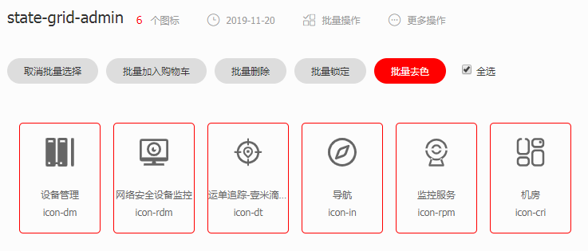
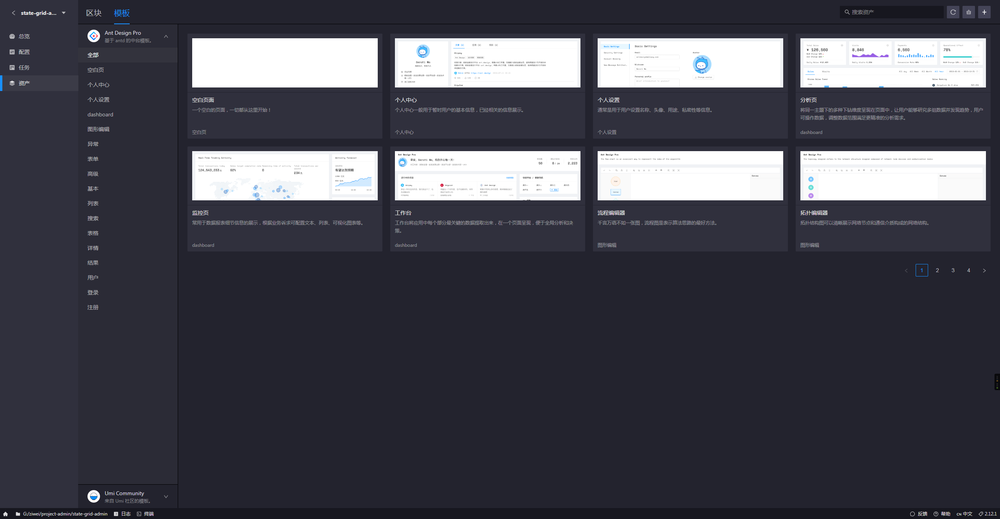

# antd-pro 使用笔记

## 添加路由

需要在 `/config/routerConfig`页面添加路由配置

## 使用iconfont作为菜单的图表

关键代码

```javascript
const IconFont = Icon.createFromIconfontCN({
  scriptUrl: '//at.alicdn.com/t/font_1518170_y303tp23nz.js',
});

const getIcon = icon => {
  console.log(icon, isMenuIcon(icon))
  if (typeof icon === 'string' && isUrl(icon)) {
    return ;
  }
  // isMenuIcon 在/utils/utils.js中声明 
  if (isMenuIcon(icon)) {
    return <IconFont type={'icon-' + icon} />
  }
  if (typeof icon === 'string') {
    return <Icon type={icon} />;
  }
  return icon;
};
```

## 添加webpack配置

需要在 `/config/webpackConfig`中使用 `webpack-chain`  添加 `webpack` 配置

举个例子  给 `webpakc` 添加一个新的 `alias`配置

```javascript
const path = require('path')
const { resolve } = path
export const webpackChain = (config, { webpack }) => {
  config.resolve.alias
    .set('config', resolve('./config'))
}
```

## 解决菜单选中项图标不变色问题

解决方法：

通过 iconfont 将字体图标批量去色

​    

> [关于symbol引用](https://github.com/thx/iconfont-plus/issues/350#issuecomment-278269496)
>
> [SVG 图标制作指南](https://zhuanlan.zhihu.com/p/20753791?refer=FrontendMagazine)

## 添加区块模板

在很多时候可以直接使用 `Antd Pro`内建的模板去搭建页面

1. 通过 `http://localhost:3000/`打开 `Umi UI`
2. 选择你正在开发项目
3. 资产 => 模板，选择需要的模板添加即可
​    

