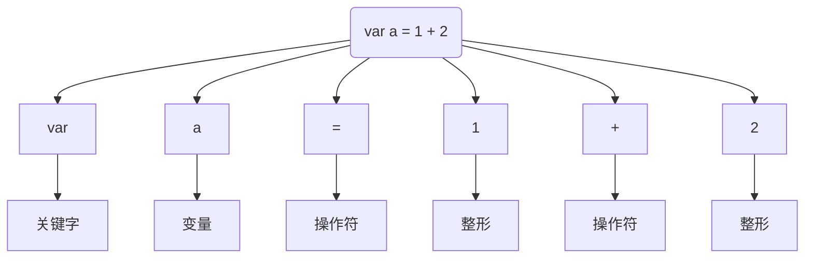
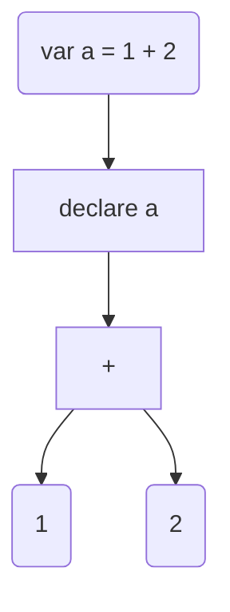
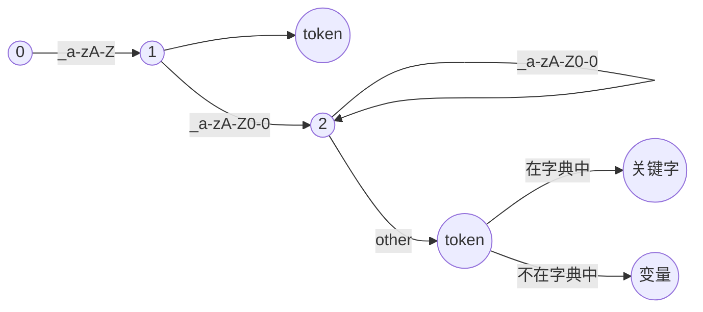

## 编译的流程（关注度分离）

### 词法分析

词法分析是分词断句 + 判断词性的过程



### 语法分析



> - 语法分析是根据词法分析结果形成抽象语法树 ( Abstract Syntax Tree ) 的过程
> - 语法分析器常常被成为 Parser

### 语法规则

```
expr -> 1 + expr | 1
```

### 语义分析

- 通过语义分析对抽象语法树进行语法检查非常重要
- 通过语法检查可以发现 \* 不能作用到整数和字符串

### 翻译：中间代码

```
var a = 1 + 4 * 5

t1 = 4 * 5
t2 = 1 + t1
var a = t2
```

### 生成机器码

- 机器不懂高级语言
- 机器像卡片机一样，不断读取下一条指令并执行
- 这种简单的设计就是今天复杂的计算机

### 运行时环境

- 有点编译器将代码编译成机器码，按照操作系统的约定编译成一个应用，运行成为操作系统的 **进程**
- 有点编译器将代码编译成中间代码（字节码，三地址代码等），然后再在操作系统中启动一个**虚拟容器（进程）**来执行他们
- JIT 编译器一遍执行中间代码，一遍编译他们

## 词法分析器

### 词法分析

- 将字符流转成符号流。源代码 => 符号流
- 类似语文学习的 **词性标注**，每个符号是一个元组，应该至少包括一个字符串和一个词性描述。

### 符号

- 词法分析器的结果是一个个的符号，英文叫 Token，也叫词法单元
- 数学上一个符号是一个元组，例如整数 123 可以表示为（123，Integer）

### 符号类型

- Keyword 关键字
- Variable 变量
- Operator 操作符
- Bracket 括号
- String 字符串
- Boolean 布尔
- Integer 整形
- Float 浮点

## Lexer

### 流（Stream）是什么？

- 流：随着**时间推移**逐渐产生的**可用数据序列** 。
- 类比：工厂流水线上需要处理的一个个产品。每个工人从流中拿起物件进行加工再放回去（流的处理节点）。
- 作用：抽象出像工厂流水线一样处理数据的标准过程。

### 流的标准接口

- 一般情况，流需要提供获取下一个数据的接口（next、hasNext 方法）
- next 方法读取到一个数据后，这个数据就相当于流过去了，因此 无法重复读取

### PeekIterator

```
     next 	peek
      ⬇️  	⬇️
v1 ➡️ v2 ➡️ v3 ➡️ v4
```

- `next` 指向下一次迭代的值
- `peek` 指向 `next`的下一个值
- `putBack`操作 `next`指针往回走一步

### 词法&语法

- **词法**就是构词的方法（有哪些词性？有哪些字母？有哪些词语？）
- **语法**就是造句的方法
- 编译器制作过程中我们通常用**正则表达式**来表述词法，然后用**状态机**来实现正则表达式

### 串和语言

- 字母表：语言允许的所有字符（UTF-8）
- 串：是语言字母表中字母的一个有穷序列；通常用希腊字母 ε 代表空串
- 不可能所有的串都是语言支持的，因此我们通常用一些约束规则来描述串，其中就有**正则表达式**

### Review ：词法分析器的目标

- 给定程序（L）以及所有 L 支持的词汇，从中找出这些词汇并为他们标注词性。
- 如果源代码中有语言（L）不支持的词汇，报错并提示用户。

### 最简问题：区分关键词和变量名

- **关键词**和**变量名**都以字母下划线开头，但有所区别

- 正则表达：`[_a-zA-Z][a-zA-Z0-0]*`

- 状态机描述：

