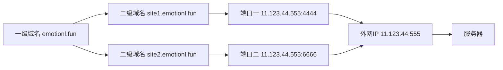

## 真实应用

### 背景

一台阿里云 ECS，一个域名

### 需求

`emotionl.fun` 的二级域名分别指向服务器的两个服务



### 实现思路

使用`nginx`的`upstream`控制上游服务器，用`proxy_pass`进行反向代理

### 操作

1. 使用第一台 `nginx` 开启两个静态服务

    ```nginx
    worker_processes 1;

    events {
        worker_connections 1024;
    }

    http {
        include mime.types;
        default_type application/octet-stream;
        sendfile on;
        keepalive_timeout 65;
        gzip on;
        gzip_min_length 1024;
        gzip_comp_level 2;
        gzip_types text/plain text/css application/x-javascript application/javascript application/xml;
        server {
            listen 4444;
            location / {
                alias test_website/site1/;
            }
            location = /50x.html {
                root html;
            }
            error_page 500 502 503 504  /50x.html;
        }
        server {
            listen 6666;
            location / {
                alias test_website/site2/;
            }
            location = /50x.html {
                root html;
            }
            error_page 500 502 503 504  /50x.html;
        }
    }
    ```

2. 使用第二台 `nginx`开启反向代理

    ```nginx
    worker_processes 1;
    
    events {
        worker_connections 1024;
    }
    
    http {
        include mime.types;
        default_type application/octet-stream;
        sendfile on;
        keepalive_timeout 65;
        upstream site1 {
            server 127.0.0.1:1234;
        }
        upstream site2 {
            server 127.0.0.1:2342;
        }
        server {
            listen 80;
            server_name site1.emotionl.fun;
            location / {
                proxy_set_header Host $host;
                proxy_set_header X-Real-IP $remote_addr;
                proxy_set_header X-Forwarded-For $proxy_add_x_forwarded_for;
                proxy_pass http://site1;
            }
            location = /50x.html {
                root html;
            }
            error_page 500 502 503 504  /50x.html;
        }
        server {
            listen 80;
            server_name site2.emotionl.fun;
            location / {
                proxy_set_header Host $host;
                proxy_set_header X-Real-IP $remote_addr;
                proxy_set_header X-Forwarded-For $proxy_add_x_forwarded_for;
                proxy_pass http://site2;
            }
            location = /50x.html {
                root html;
            }
            error_page 500 502 503 504  /50x.html;
        }
    }
    ```
